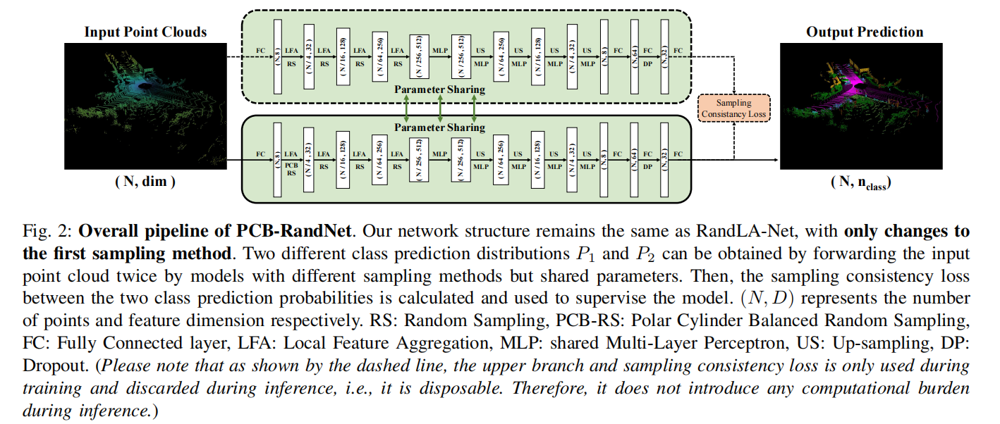

<p align="center">
  <h2 align="center"><strong>PCB-RandNet: Rethinking Random Sampling for LIDAR Semantic Segmentation in Autonomous Driving Scene</strong></h2>
  <p align="center">
      <a href="https://scholar.google.com/citations?user=L39a9d8AAAAJ" target='_blank'>Huixian Cheng</a>,&nbsp;
      <a href="https://scholar.google.com/citations?user=4FaCTFgAAAAJ" target='_blank'>Xianfeng Han</a>,&nbsp;
      Hang Jiang, Dehong He, Guoqiang Xiao
    <br>
  College of Computer and Information Science, Southwest University
  </p>

<h4 align="center">
  [arXiv]
</h4>

<div align="center">
  
</div><br/>


## Abstract
Fast and efficient semantic segmentation of large-scale LiDAR point clouds is a fundamental problem in autonomous driving. To achieve this goal, the existing point-based methods mainly choose to adopt Random Sampling strategy to process large-scale point clouds. However, our quantative and qualitative studies have found that Random Sampling may be less suitable for the autonomous driving scenario, since the LiDAR points follow an uneven or even long-tailed distribution across the space, which prevents the model from capturing sufficient information from points in different distance ranges and reduces the model's learning capability. To alleviate this problem, we propose a new Polar Cylinder Balanced Random Sampling method that enables the downsampled point clouds to maintain a more balanced distribution and improve the segmentation performance under different spatial distributions. In addition, a sampling consistency loss is introduced to further improve the segmentation performance and reduce the model's variance under different sampling methods. Extensive experiments confirm that our approach produces excellent performance on both SemanticKITTI and SemanticPOSS benchmarks, achieving a 2.8% and 4.0% improvement, respectively.


## Environment Setup
Install python packages
```
conda env create -f my_env.yaml
conda activate randla
```
Note: 
- Not all packages are necessary, you can refer to this environment to install.
- Since we are using operator `torch.take_along_dim` that are only available in pytorch version ≥ 1.9.0 in [here](https://github.com/huixiancheng/PCB-RandNet/blob/3d05d457761f5f096263b9658940bc7d01ce04eb/train_both_SemanticKITTI.py#L170), please make sure that the installed version meets the requirements.

Compile C++ Wrappers
```
bash compile_op.sh
```

## Prepare Data
Download SemanticKITTI from [official web](http://www.semantic-kitti.org/dataset.html). Download SemanticPOSS from [official web](http://www.poss.pku.edu.cn./download.html).
Then preprocess the data:

```
python data_prepare_semantickitti.py
python data_prepare_semanticposs.py
```
Note: 
- Please change the data path with your own path.
- Change corresponding path `self.dataset_path` in all `.py` in dataset (such as [here](https://github.com/huixiancheng/PCB-RandNet/blob/3d05d457761f5f096263b9658940bc7d01ce04eb/dataset/semkitti_trainset.py#L32)).

## Training

1. Training baseline with RS or PCB-RS

```
python train_SemanticKITTI.py <args> 

python train_SemanticPOSS.py <args>

Options:
--backbone           select the backbone to be used: choices=['randla', 'baflac', 'baaf']
--checkpoint_path    path to pretrained models(if any), otherwise train from start
--log_dir            Name of the log dir
--max_epoch          max epoch for the model to run, default 80
--batch_size         training batch size, default 6 (indicated in oroginal implementation), modify to full utilize the GPU/s
--val_batch_size     batch size for validation, default 30
--num_workers        number of workers for I/O
--sampling           select the sampling way: RS or PCB-RS. choices=['random', 'polar']
--seed               set random seed
--step               set length of dataset: 0 mean use all data || 4 mean use 1/4 dataset
--grid               resolution of polar cylinder
```

2. Training model with PCB-RS and SCL
```
python train_both_SemanticKITTI.py <args>

python train_both_SemanticPOSS.py <args>

Options:  Similar to before.
```

## Test

```
python test_SemanticKITTI.py <args>

python test_SemanticPOSS.py <args>

Options:
--infer_type         all: infer all points in specified sequence, sub: subsamples in specified sequence
--sampling           select the sampling way: RS or PCB-RS. choices=['random', 'polar']
--backbone           select the backbone to be used: choices=['randla', 'baflac', 'baaf']
--checkpoint_path    required. path to the model to test
--test_id            sequence id to test
--result_dir         result dir of predictions
--step               set length of dataset: 0 mean use all data || 4 mean use 1/4 dataset (Only use for SemanticKITTI)
--grid               resolution of polar cylinder
```
**Note:** 
- **For SemanticKITTI dataset, if your want to infer all data of 08 sequence, please make sure you have more than 32G of free RAM.**

- **Due to the use of `torch_data.IterableDataset`, the num_workers needs to be set to 0 and cannot use multi-threaded acceleration, so the test speed will be very slow. Welcome to propose a feasible accelerated PR for this. (This [reference](https://medium.com/speechmatics/how-to-build-a-streaming-dataloader-with-pytorch-a66dd891d9dd) may be useful)**

## Other Utils
1. Evaluation with Distances
```
python evaluate_DIS_SemanticKITTI.py <args>     ||      python evaluate_DIS_SemanticPOSS.py <args>
```
2. Visualization
```
python visualize_SemanticKITTI.py <args>
```
This code is not used, so it has not been tested and may have bugs. If you want to use this code to visualize SemanticKITTI and SemanticPOSS, please refer to [this repo](https://github.com/PRBonn/semantic-kitti-api) and [this repo](https://github.com/huixiancheng/CENet).

3. Others in tool.
```
caculate_time.py            Use to get Time Consumption Comparison between RS, PCB-RS, and FPS.
draw.py / draw_poss.py      Use to draw performance plot at different distances.
draw_vis_compare.py         Use to generate qualitative visualization and quantitative statistical analysis images between RS and PCB-RS similar to the paper.
eval_KITTI_gap.py           Use to calculate the difference in performance of the model under different sampling methods.
main_poss.py                Use to count distance distribution
```

## Others to Note and Clarify

- All our experiments were trained on a single NVIDIA RTX 3090 GPU using mixed precision.
- We set `torch.backends.cudnn.enabled = False` and use `with torch.cuda.amp.autocast():` to reduce training time and save GPU memory. However, it is not certain whether it will have an impact on performance.
- In `train_SemanticKITTI.py`, We use `num_classes = 20` instead of `num_classes = 19`. The reason is that I think the [ops](https://github.com/huixiancheng/PCB-RandNet/blob/main/network/loss_func.py) used to calculate the loss in the original code is very complex, and its main point is to ignore the loss when `label == 0`. Therefore, I just changed the num_classes to 20 and set the weight of `label == 0` to 0 to achieve it.
- In fact, the criterion corresponding to `compute_loss` should be `self.criterion = nn.CrossEntropyLoss(weight=class_weights, reduction='none')` instead of `self.criterion = nn.CrossEntropyLoss(weight=class_weights)`. This may affect the scale of the computed loss, but should not affect performance.
- There are two ways to calculate SCL, one is the [L1 loss](https://github.com/huixiancheng/PCB-RandNet/blob/05f2d4c796ac68d45745ddea2b7d0119c43cc0a5/train_both_SemanticKITTI.py#L172) used by default, and the other is method [here](https://github.com/huixiancheng/PCB-RandNet/blob/05f2d4c796ac68d45745ddea2b7d0119c43cc0a5/train_both_SemanticKITTI.py#L127-L135) from CPGNET.
- In terms of loss size, the default L1 loss is better used with `reduction='mean'` and `consistency_loss_l1` is better used with `reduction='none'`. Some of our experimental results show that the performance of the models trained in both settings is comparable.
- Since the two losses used L_ce and L_scl may be correlated. Therefore the uncertainty weighting method may not converge using random initialization. In our experiments, we set `ce_sigma==0.27` and `l1_sigma==0.62` because they are close to our initial experimental values with `seed==1024`. Some of our experiments show that the model converges effectively with `ce_sigma in range [0.2, 0.3]` and `l1_sigma in range [0.6, 0.8]`.
- For BAF-LAC backbone, our implemented model is as consistent as possible with the [original Repo](https://github.com/Xiangxu-0103/BAF-LAC).
- For BAAF backbone, our implementation is slightly different from the [original Repo](https://github.com/ShiQiu0419/BAAF-Net), which will result in some performance differences. While the original Repo used FPS sampling, I changed to RS sampling to keep the framework structure consistent. The original Repo used an auxiliary loss, in order to keep simple, we did not use this part.
- Since I' m not good at coding & optimization, the code of [PCB-RS](https://github.com/huixiancheng/PCB-RandNet/blob/05f2d4c796ac68d45745ddea2b7d0119c43cc0a5/dataset/semkitti_trainset.py#L130-L230) is very rough, if you are interesting in optimizing & accelerating this part, welcome to PR !

## Acknowledgement
- This repo is heavily based on [RandLA-Net-pytorch](https://github.com/tsunghan-wu/RandLA-Net-pytorch), many thanks to the author for the excellent Pytorch reproduction. :thumbsup:
- Our code refers in varying degrees to the Repos listed below: [RandLA-Net](https://github.com/QingyongHu/RandLA-Net), 
[BAAF-Net](https://github.com/ShiQiu0419/BAAF-Net), 
[BAF-LAC](https://github.com/Xiangxu-0103/BAF-LAC), [PolarNet](https://github.com/edwardzhou130/PolarSeg), 
[Cylinder3D](https://github.com/xinge008/Cylinder3D), [R-Drop](https://github.com/dropreg/R-Drop),
[JS3C-Net](https://github.com/yanx27/JS3C-Net), [Pointnet_Pointnet2_pytorch](https://github.com/yanx27/Pointnet_Pointnet2_pytorch),
[AutomaticWeightedLoss](https://github.com/Mikoto10032/AutomaticWeightedLoss), [MINet](https://github.com/sj-li/MINet). Thanks a lot for their open source code. :heart:
- Thanks to PhD. Qiu & PhD. Li for the code help on BAAF-Net and CPGNet in the email. :heart:
- Thanks for the answers provided in this stackoverflow [question](https://stackoverflow.com/questions/42232540/how-to-find-indices-of-a-reordered-numpy-array).
- The paper was inspired by a helpful discussion with RandLA-Net authors at China3DV in Xiamen in June 2021, thanks the insightful comments and feedback from [PhD. Hu](https://github.com/QingyongHu). :heart:


## Citation
If you find this work helpful, please consider citing our paper:
~~~
Soon
~~~